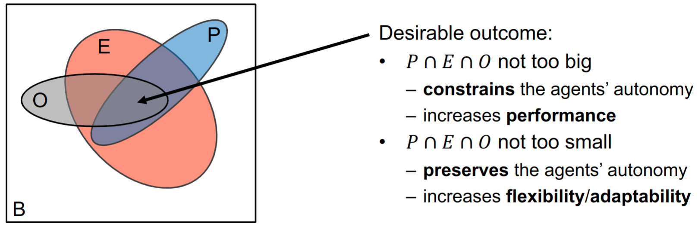

# Submission WAS-exercise-8

Github Fork: https://github.com/Scraylex/WAS-exercise-8

## Task 3)

### Q: 

Consider that agents might be required to solve (complex) planning problems to reach their
goals (remember our session on automated planning). What advantages do you see for having
a top-down explicit specification of agent coordination patterns in this case?

### A:

First I would like to point to the following illustration from our lecture about Normative Multi Agent Systems Organizations by Andrei Ciortea and Danai Vachtsevanou, adapted from O.Boissiers, Multi-Agent Programming Course.

This is to state that if you think about the possible actions an agent can take as sets of predefined plans then adding an organizations is used to limit the amount of actions it can take at a given moment. This limiting stems from multiple factors such as environment, organisation and the agents striving towards certain preprogrammed goals.

The main problem with reasoning about complex tasks is that it is expensive and can result in a variety of algorithmic problems as was seen in exercise 2 when we talked about the sussman anomaly. That is to say that it scales very badly with an increased number of logical pathways the planner would have to account for. Subsequently we limit the possible available nodes via organizations made to achieve specific tasks.

The constructs of groups and roles inside the organizations are especially hard constraints. 
Highly complex reasoning tasks are become much more feasible utilizing these constructs and breaking down the requirements into smaller subtasks and roles. The agent can then take up these functions temporarily and also leave the working groups again after achieving a task.

Ultimately the top down organization is just another tool in the toolbox of a multi agent system used to increase performance, scalability and ease development by making another tier of constraints available limiting autonomy but increasing performance. Expressing the desired coordination of the agents like this makes it much more understandable for the programmers setting up the system because it resembles human structures and organizational techniques.
